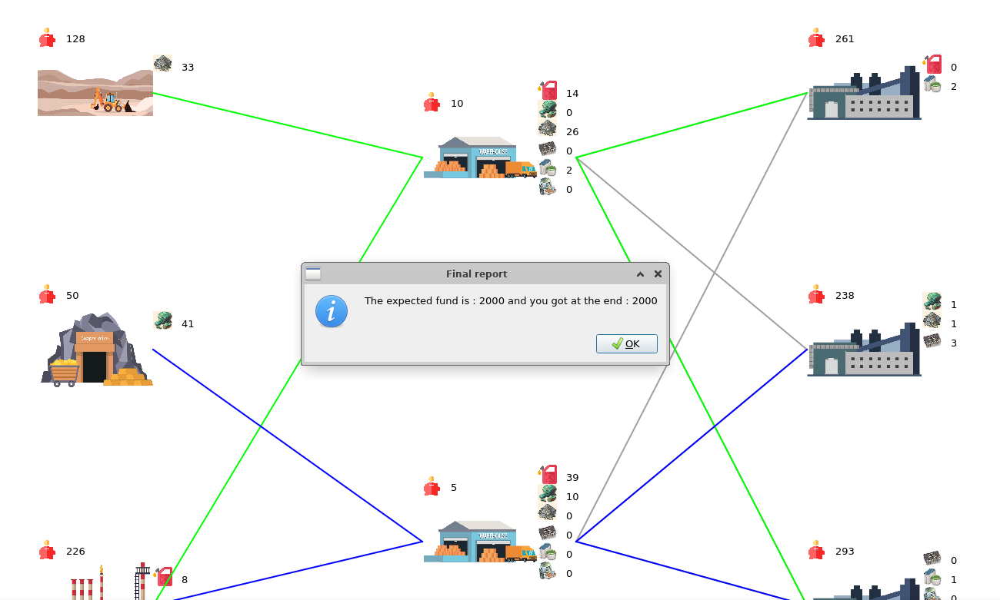
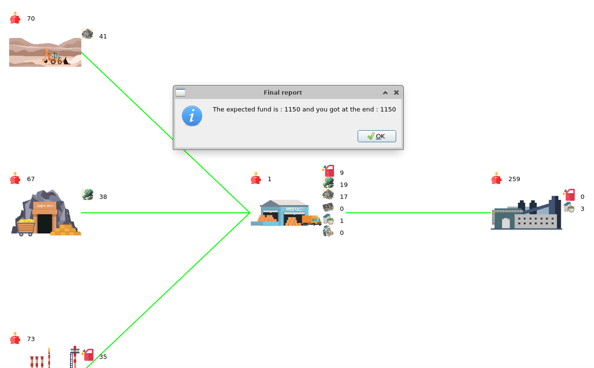
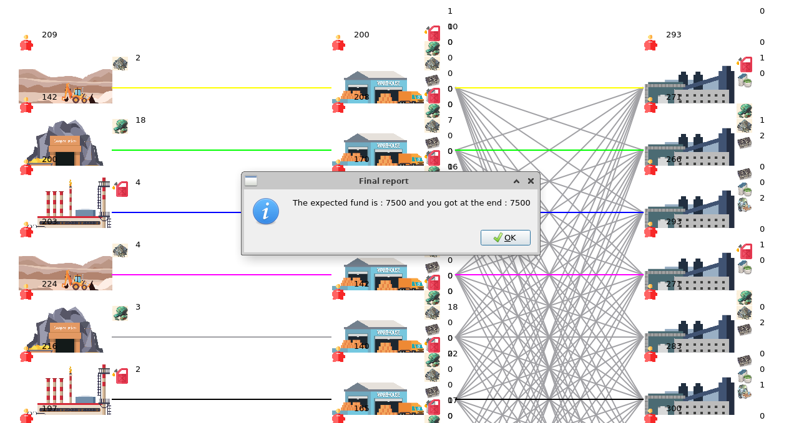

# PCO Labo 3 Rapport - Gestion d'accès concurrents

Auteurs: Benoit Delay, Eva Ray

## Description des fonctionnalités du logiciel

 Le logiciel simule les ventes et achats entre des extracteurs de ressources, des grossistes et des usines. Pour ce faire, nous travaillons avec l'interface ```Seller```, dont les classes ```Extractor```, ```Wholesale``` et ```Factory``` représentant les différentes acteurs de la simulation héritent. 

 Un extracteur est simulé par un thread qui exécute sa méthode ```run()```. Un extracteur va, s'il a les fonds, payer un employé pour extraire la ressource qu'il produit. Un extracteur peut vendre ses ressources à d'autres acteurs de la simulation grâce à sa méthode ```trade(...)```.

 Un grossiste est simulé par un thread qui exécute sa méthode ```run()```. Le grossiste va acheter de manière aléatoire des ressources aux autres acteurs de la simulation. Ces achats sont simulés par la méthode ```buyRessources(...)```. Un grossiste peut revendre ses ressources grâce à sa méthode ```trade(...)```.

 Une usine est simulée par un thread qui exécute sa méthode ```run()```. Si elle a les ressources nécessaires, une usine va constuire la ressource qu'elle produit grâce à sa méthode ```buildItem(...)```. Sinon, elle va essayer d'acheter les ressources nécessaires chez un grossiste en priorisant les ressources qu'elle n'a plus en stock. Cet achat est simulé par la méthode ```orderRessources(...)```. Une usine peut vendre le fruit de sa production aux grossiste grâce à sa méthode ```trade(...)```.

 Ce logiciel simule le comportement de chaque acteur en lançant un thread, il est donc multi-threadé. Par conséquent, il doit assurer une bonne gestion de la concurrence pour les ressources partagées entre plusieurs threads.

La fin de la simulation se fait lorsqu'on ferme la fenêtre de l'application. Les threads doivent s'arrêter correctement et le résultat du calcul du total des fonds est alors affiché.

## Choix d'implémentation

Comme chaque ```Seller``` est simulé par un thread, nous devons assurer qu'il n'y a pas de problème de concurrence sur les ressources partagées. Les ressources partagées entre les threads sont, pour chaque instance des classes ```Extractor```, ```Wholesale``` ou ```Factory``` les attributs ```stocks``` et ```money```. En effet, on doit s'assurer que si plusieurs threads essaient de mettre à jour ces ressources en parallèle, le résultat final est intègre.

Pour cela, nous avons ajouté un attribut protected ```PcoMutex mutex``` dans l'interface'```Seller``` qu'on va vérouiller avant chaque modification ou certaines lectures des attributs concernés. Nous avions pensé à mettre deux mutex par classe, un pour protéger ```stocks``` et un pour protéger ```money```. Cependant, nous avons observé que ces deux mutex étaient tout le temps vérouillé et dévérouillé en même temps, nous les avons donc fusionnés en un unique mutex. En effet, dans notre simulation d'achat et de vente, les attributs ```stocks``` et ```money``` sont intrinsèquement liés et peuvent donc être protégés par un unique mutex. 

Nous vérouillons le mutex à chaque fois que le contenu des attributs ```stocks``` ou ```money``` est mis à jour ou lorsque nous avons besoin que l'état d'un de ces attributs reste inchangé pendant un certain moment (par exemple, lorsque l'on veut que la condition d'un if reste vraie). Nous avons tout de même essayé de réduire au maximum les zones de code protégées pour le mutex, puisque cela ralentit significativement le programme. Nous avons explicité l'exemple de la méthode  ```Extractor::trade()``` plus bas pour illustrer ces décisions.

Nous faisons toujours en sorte qu'un mutex vérouillé dans une méthode soit aussi dévérouillé dans cette même méthode, afin d'éviter des situations où le mutex serait vérouillé plusieurs fois de suite, ce qui pourrait cause un deadlock. Nous faisons donc attention à dévérouiller le mutex avant chaque ```return```, ```continue``` ou ```break```, si nécessaire. 

Nous avons aussi relâché le mutex autour des fonctions ```PcoThread::usleep(...)``` car ça n'a pas d'incidence sur l'intégrité des ressources partagées et cela nous permet de gagner du temps. 

Nous avons choisi de logger certaines informations dans la fenêtre de l'application, afin que l'utilisateur puisse comprendre facilement l'état de la simulation.

### Exemple

```cpp
int Extractor::trade(ItemType it, int qty) {

    if(it != resourceExtracted or qty <= 0){
        return 0;
    }

    int price = getMaterialCost() * qty;

    mutex.lock();
    if(stocks[it] < qty ){

        mutex.unlock();
        return 0;
    }

    money += price;
    stocks[it] -= qty;
    mutex.unlock();

    return price;
}
```

Premièrement, nous avons décidé de cinder le ```if``` en deux, ce qui nous permet de ne pas vérouiller le mutex pour rien. Nous avons donc un premier if, avant lequel nous ne vérouillons pas le mutex car il ne concerne que des ressources qui ne sont pas partagées. Nous calculons aussi le prix, qui ne dépend pas non plus de ressources partagées. Nous vérouillons ensuite le mutex avant le deuxième ```if```, car une fois que nous savons que nous avons assez de stock pour faire la transaction, on ne veut pas que cela change. Dans le cas où nous n'avons pas les stocks nécessaires, on n'oublie pas de dévérouiller avant de ```return``` pour éviter un deadlock. On met ensuite ```stocks``` et ```money``` à jour puis on dévérouiller le mutex.

### Interblocage entre une usine et un grossiste

Un interblocage est possible à cause des méthodes ```Factory::orderRessources(...)``` et ```Wholesale::buyRessources(...)```. En effet, ```Factory::orderRessources(...)``` appelle ```Wholesale::trade(...)``` et ```Wholesale::buyRessources(...)``` appelle ```Factory::trade(...)```. Si ces méthodes vérouillent les mutex de leur classe respective au début de leur code, on peut se retrouver en situation d'interblocage où les deux attendent que l'autre relâche le mutex, ce qui les bloque donc indéfiniment. 

Pour éviter cela, nous pouvons constater dans la méthode ```Factory::run()``` que les méthodes ```Factory::orderRessources(...)``` et ```Factory::buildItem(...)``` ne peuvent jamais être appelées en même temps. La seule méthode qui peut être appelée en même temps que ```Factory::orderRessources(...)``` est ```Factory::trade(...)```. Nous pouvons donc en déduire qu'une fois que nous entré dans ```Factory::orderRessources(...)```, l'attribut ```money``` de l'usine peut potentiellement augmenter mais jamais diminuer. Nous nous servons donc de cette information pour vérouiller le mutex de ```Factory``` après la vérification de la condition du ```if``` qui permet d'assurer que l'usine a assez d'argent pour acheter des ressources et après l'appel à ```Wholesale::trade(...)```. Ainsi, nous évitons une situation de deadlock. Cette partie du code de ```Factory::orderRessources(...)``` est donnée ci-dessous.

```cpp
for(auto wholesale : wholesalers){

    interface->consoleAppendText(uniqueId, QString("I would like to buy 1 " + getItemName(resource)));


    if(money < price or wholesale->trade(resource,1) == 0){

        interface->consoleAppendText(uniqueId, QString("The order cannot be processed"));
         continue;
    }

    mutex.lock();
    money -= price;
    stocks[resource]++;
    mutex.unlock();

    // On a réussi à acheter la ressource
    interface->consoleAppendText(uniqueId, QString("The order has been processed"));
    break;
 }
```


## Tests effectués

Comme faire des tests unitaires pour ce programme n'est pas très approprié, nous avons vérifé manuellement les points suivants, en se basant sur la fenêtre affichée par l'application.

### Tests généraux

Pour tester notre programme, nous avons verifié manuellement que 
- Les extracteurs minent bien leurs ressources en payant leurs employés et en augmentant leurs stocks
- Les extracteurs peuvent vendre leurs ressources aux grossiste, ce qui diminue leurs stocks
- Les grossistes payent bien les matières premières des extracteurs ou la marchandise des usines et les ajoutent dans leurs stocks
- Les grossistes peuvent vendre leurs ressources aux usines, ce qui diminue leurs stocks
- Les usines achètent les composants dont ils ont besoin aux grossistes et les ajoutent dans leurs stocks
- Les usines fabriquent bien leur marchandise en payant leurs employés et en augmentant leurs stocks
- Les usines peuvent vendre leur marchandise aux grossistes, ce qui diminue leurs stocks
- La fin de la simulation se passe bien lorsqu'on appuie sur la fenêtre et le résultat final apparaît et est correct

Une exécution typique du programme produit le résultat suivant lorsqu'on l'arrête en appuyant sur la croix:



On constate que le résultat des fonds totaux est correct.

Testons en faisant quelques changement dans la classe ```utils.h```, afin qu'on ait exactement une usine et un grossite. 



Nous constatons que l'usine et le grossiste arrivent correctement à acheter des ressources l'un à l'autre.

Testons en mettant 10 mines, 10 grossistes et 10 usines.



On constate que même avec un grand nombre de threads, le programme arrive à s'arrêter en affichant le bon résultat. Il faut toutefois parfois être un peu patient, les threads mettent un certain temps à s'arrêter car il faut que les méthodes run détectent le ```requestStop()```. 

### Tests modfication de usleep

Dans notre programme, il y a plusieurs endroits où la fonction ```usleep()```, qui suspend l'exécution d'un thread pendant un certain moment est appelée. Cela nous facilite un peu la tâche car, en quelque sorte, cela "diminue" les problèmes d'accès aux ressources partagées. Testons donc ce qu'il se passe lorsqu'on réduit ce temps de sleep.

Nous avons pu constater que lorsqu'on divise le temps des usleep par maximum un facteur 100, le programme se comporte exactement comme attendu; on peut quitter en cliquant sur la croix et le résultat final s'affiche et est correct. 

A partir d'un facteur 1000, ou si on décide d'enlever complètement les usleep, le comportement n'est plus toujours garanti. En effet, lorsqu'on essaie de quitter le programme en appuyant sur la croix, celui-ci crashe la plupart du temps. Cela peut potentiellement être dû à un deadlock mais il est plus probable que le programme soit dépassé par les événements, trop rapides pour lui, et me puisse pas reprendre la main sur le thread principal. 

## Conclusion

Nous avons implémenté un programme multi-threadé qui simule les ventes et achats entre des extracteurs de ressources, des grossistes et des usines.  Nous avons implémenté une gestion de la concurrence et d'accès aux ressources partagées grâce à des mutex, qui semblent faire leur travail correctement. Le programme et les acteurs se comportent comme attendu et nous pouvons mettre fin à la simulation correctement, en appuyant sur la croix de la fenêtre.